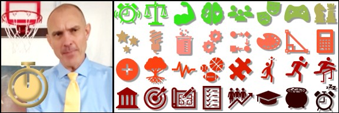

# Sport of Life
### The Create Wonder Game  
A coaching philosophy, creative work in progress, a personal development guide, written as a we story and a gamification of life, to inspire, **for and by Mitch Skolnekovich**, March 2025.

## Character & Conduct & Creation
### Spirit of Sportsmanship
A sport is a fun activity with a clear objective, a way to measure (or score) progress, a time limit, and a clear rank (such as first place, highest score, or most valuable player), with positive **character and conduct** displayed by all involved (sportsmanship).

### Lifelong Objective to Create
In the timeless “Create Wonder” Sport of Life game, the world is the arena, and the objective is to **Believe in Your Unlimited Potential, give your Best Effort, in a Groveian Place to Work (GPTW), to Create Wonder, a More Wonderful World!**

In Sport of Life, we are **lifelong student-athletes**, and to win, we must overcome obstacles to become all we can be spiritually, mentally, and physically to contribute meaningfully; help others do the same and be an asset to the community.

In short, **Sport of Life is gamification of spiritual, mental, and physical pursuits**, scoring points along the way, expanding on the basic idea of sports as a physical activity where **creation is greater than competition**.

### Character Traits: The "IF" Framework
We can create and center on our character traits if **we shape our thoughts, emotions, and actions**.
A fabulous example, the “IF” character traits, which are values that cleverly begin with the letter “I” and “F”, complementing the sentence “I wonder IF…”
| "IF" Trait | I wonder IF... |
| ---- | ---- |
| Imagination + Faith | ...exploring imagination for what could be + faith for believing it will become. |
| Intent + Focus | ...shaping intent for clear purpose + focus to progress. |
| Initiative + Fervor | ...showing initiative to drive action + fervor to overcome obstacles as they arise. |
| Ingenuity + Friendship | ...using ingenuity for creative problem solving + friendship for support and joy. |
| Industriousness + Forte | ...engaging industriousness for best effort + forte for a better, faster, cheaper way. |

> ***A CHEERLEADER, COACH, AND PLAYER OF LIFE***  

## Time & Talent & Team
As our game begins, we join a team (family, friends, community), which we significantly depend on as we develop our skills. As time goes on, we will join other teams by assignment or choice. Our turn (playing time) starts as **we rise each day to make choices for how to use the time we have**, developing our talents, contributing to and through trustworthy teams.

### Positivity is Magic for Overcoming Negativity
We will not get more playing time, so we must use our time wisely to **imagine and behave respectfully to shape reality**; we must believe, focus, do; overcoming obstacles as they arise—the biggest obstacle in Sport of Life is negativity.

Our negative thoughts and emotions tend to produce negative actions. We must believe in magic, practicing five positives for each negative regarding ourselves, our environment, and our team (Magic Ratio). **We are positive.**

### Nature is Inspiring
We reflect on the analogy of the elm tree, which has a respectable root system, and in the proper environment, can live for three hundred years and grow to a height of one hundred feet. The idea that elm trees support each other through a connected root system is even more fascinating! **We observe.**

We respect ROOTS (Rules, Opponents, Officials, Team, Self) by learning and following rules; focus on doing the best you can to create plays; do not blame or complain; be helpful, courteous, and kind; and practice self-advocacy, self-belief, and self-control, inspiring others to do the same. **We respect everything.**

We climb the ELM Tree of Mastery for 10,000 hours. As we climb, we give our best EFFORT, always willing to try and LEARN, and adapt from MISTAKES by considering adjustments to make so that we can get the next one. **We continuously try.**

### Our Goals Guide
**We create SMART goals** (specific, measurable, achievable, relevant, time-bound) to guide our efforts toward personal and team objectives, and to measure and celebrate progress achieved with proper sportsmanship. **We value character and accomplishment.**

### A Groveian Place to Work as a Team
We honestly measure our progress and accomplishments, with pride, in a Groveian Place to Work (GPTW), which is:
+ Respectful, trusting, and direct for the purpose of support and continuous improvement.
+ Focused on solving challenging problems in a better, faster, cheaper way.
+ Persistent, embracing failure as a necessary step toward success.
+ Meritocratic, rewarding behaviors, abilities, and achievements, all grounded in facts.
+ An environment that is both educational and motivational.

### Play Passionately and Positively
If we play, **we play passionately** using limited playing time to develop talent, contributing to and depending on trustworthy teams. To play the “Create Wonder” Sport of Life game:
+ Imagine all aspects of your life as a sport (this includes traditional sports, like basketball, as well as all other topics, such as the sport of math). You are the cheerleader, the coach, and the player, simultaneously.
+ Accept the responsibility for your life and respectfully pursue topics with passion and positivity.
+ Believe in your unlimited potential, giving your best effort toward goals, honestly measuring progress, persisting through failure.
+ Shape your story through the things you do, create a more wonderful world for you and your crew!

> ***BELIEVE, FOCUS, AND DO: SPIRITUALLY, MENTALLY, AND PHYSICALLY***  

## Support & Sincerity & Shoutouts
I hope you enjoyed this creative work in progress and invite you to:
+ Share your own philosophy.
+ Comment.
+ Follow [Mitch Skolnekovich on LinkedIn](https://www.linkedin.com/in/mitchskolnekovich/), as he passionately plays Sport of Life!

I believe this to be personal and unique work, you may recognize the works of others, which I did not cite directly, yet.
Inspiring people and works are listed below, if I missed one let me know; and [Assets Manifest for Sport of Life](assets/assets_manifest.md) is the growing list of dependencies and references.

I consider myself wise and well-read and thank (and recommend) Andy Grove, Pat Gelsinger, Jo Boaler, Stephen R. Covey, Brené Brown, Richard Rohr, Carol Dweck, John Wooden, Malcolm Gladwell, Jim Thompson (Positive Coaching Alliance), Michael Jordan, The Last Dance docuseries, 13 Lady Wildcats, Centers for Disease Control and Prevention, National Federation of State High School Associations, and much more for inspiration and contribution to the “Create Wonder” Sport of Life game!

> ***A MORE WONDERFUL WORLD, ONE PLAY AT A TIME***  

### Sport of Life
